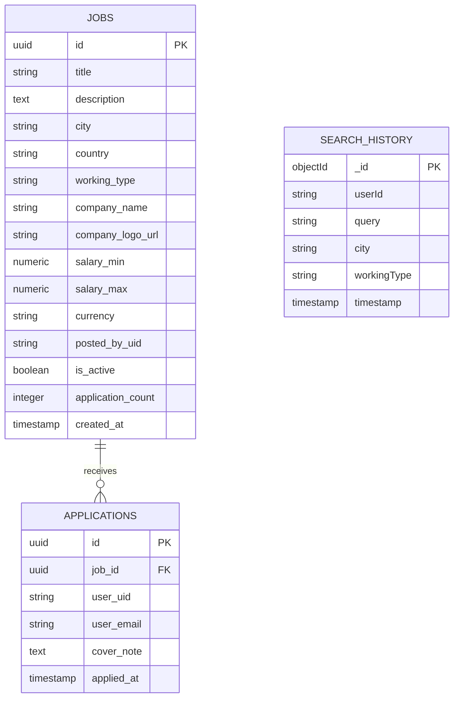

# Be Work Ready - Microservices Job Platform

A complete, production-ready job search platform built with microservices architecture.

Youtube Video Link:https://youtu.be/8L7dxfgWWhc

## 🌐 Live Deployment

### Frontend
https://beworkready.vercel.app/

### API Gateway
https://beworkready-gateway.onrender.com

### Microservices

- Job Posting Service: https://beworkready-job-posting-service.onrender.com
- Job Search Service: https://beworkready-job-search-service.onrender.com
- Notification Service: https://beworkready-notification-service.onrender.com
- AI Agent Service: https://beworkready-ai-agent-service.onrender.com

## 🩺 Service Health Checks

All microservices expose a `/health` endpoint for monitoring and deployment verification.

You can use these endpoints to verify system availability:

- API Gateway  
  https://beworkready-gateway.onrender.com/health

- Job Posting Service  
  https://beworkready-job-posting-service.onrender.com/health

- Job Search Service  
  https://beworkready-job-search-service.onrender.com/health

- Notification Service  
  https://beworkready-notification-service.onrender.com/health

- AI Agent Service  
  https://beworkready-ai-agent-service.onrender.com/health

  ## 🚀 Features

- Job search with filters and autocomplete
- AI-powered job assistant
- User search history tracking
- Job alerts and notifications
- Redis caching for performance
- RabbitMQ event-driven architecture
- Firebase authentication
## Architecture

The system is composed of the following services:

1.  **API Gateway (Node.js/Express):** Single entry point for all client requests. Handles rate limiting, routing, and Firebase authentication verification.
2.  **Job Posting Service (Node.js/Express + PostgreSQL + Redis):** Manages job creations and details. Uses PostgreSQL for reliable storage and Redis for fast read caching. Publishes events to RabbitMQ.
3.  **Job Search Service (Node.js/Express + PostgreSQL + MongoDB + Redis):** Handles search queries, autocomplete, and filtering. Reads job data from PostgreSQL (read replica simulation) and caches results in Redis. Stores user search history in MongoDB.
4.  **Notification Service (Node.js/Express + RabbitMQ + MongoDB + PostgreSQL):** Consumes events from RabbitMQ (new jobs, applications) and sends emails via Nodemailer. Uses `node-cron` for scheduled daily digests and personalized recommendations based on search history (from MongoDB).
5.  **AI Agent Service (Node.js/Express + OpenAI):** Provides a chat interface for users to find jobs using natural language. Uses OpenAI function calling to interact with internal search and job detail APIs.
6.  **Frontend (React):** A modern, dark-themed responsive UI built with React, `react-router-dom`, and custom CSS. Uses Firebase Authentication.

## Tech Stack

*   **Backend:** Node.js, Express
*   **Databases:** PostgreSQL (Relational Data), MongoDB (NoSQL/History), Redis (Caching)
*   **Message Broker:** RabbitMQ
*   **Auth:** Firebase Authentication
*   **Frontend:** React (CRA)
*   **AI:** OpenAI API (gpt-4o-mini)
*   **Infrastructure:** Docker, Docker Compose

## Prerequisites

*   Docker and Docker Compose
*   Node.js (for local development without Docker)
*   Firebase Project (for Authentication)
*   OpenAI API Key (for AI Agent)

## Setup and Deployment

1.  **Environment Variables:**
    *   Copy `.env.example` to `.env` in the root directory.
    *   Fill in the required values (Firebase Admin credentials, OpenAI Key, SMTP details).
    *   Copy `frontend/.env.example` to `frontend/.env` and fill in your Firebase Web SDK keys.

2.  **Firebase Setup:**
    *   Create a Firebase project.
    *   Enable **Google Sign-In** in Firebase Authentication.
    *   Get Web SDK config for `frontend/.env`.
    *   Generate a new private key for the Admin SDK (Service Account) and put it in the root `.env`.

3.  **Run with Docker Compose:**
    ```bash
    docker-compose up --build -d
    ```

    This will start all databases, message queues, backend services, and the React frontend.

4.  **Accessing the Application:**
    *   **Frontend:** `http://localhost:80` (or `http://localhost:3000` for API Gateway if hitting endpoints directly)

## ER Diagram (Conceptual)



## Assumptions & Design Decisions

*   **Authentication:** Gateway handles token verification. Services trust the Gateway via `x-user-uid` headers, but can also verify tokens directly for direct calls.
*   **Search DB:** For simplicity in this demo, the Search Service connects to the same PostgreSQL instance as the Posting Service (acting as a read-replica pattern). In a massive scale scenario, data would be synced to Elasticsearch.
*   **Caching:** Aggressive caching (Redis) is applied to search and listing endpoints with short TTLs to balance performance and data freshness.
*   **Notifications:** Uses Nodemailer. In production, this would integrate with SendGrid/AWS SES. RabbitMQ ensures no applications/job events are lost during high load.
