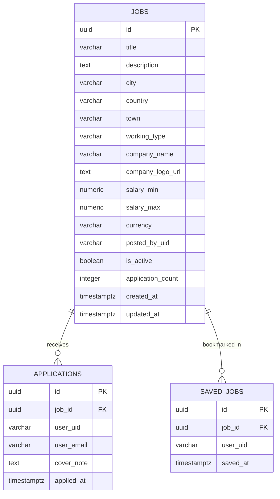

# BeWorkReady — Microservices Job Search Platform

A complete, production-ready job search platform built with a microservices architecture. Users can search for jobs, receive location-based recommendations, set up job alerts, save favourites, and get career guidance from an AI assistant.

---

## 🌐 Live Deployment

| Service | URL |
|---|---|
| **Frontend** | https://beworkready.vercel.app/ |
| **API Gateway** | https://beworkready-gateway.onrender.com |
| **Job Posting Service** | https://beworkready-job-posting-service.onrender.com |
| **Job Search Service** | https://beworkready-job-search-service.onrender.com |
| **Notification Service** | https://beworkready-notification-service.onrender.com |
| **AI Agent Service** | https://beworkready-ai-agent-service.onrender.com |

---

## 🩺 Service Health Checks

All microservices expose a `/health` endpoint:

- API Gateway → https://beworkready-gateway.onrender.com/health
- Job Posting Service → https://beworkready-job-posting-service.onrender.com/health
- Job Search Service → https://beworkready-job-search-service.onrender.com/health
- Notification Service → https://beworkready-notification-service.onrender.com/health
- AI Agent Service → https://beworkready-ai-agent-service.onrender.com/health

---

## 🎬 Demo Video

https://youtu.be/8L7dxfgWWhc

---

## 🚀 Features

- **Job Search** — Filter by title, city, town, country, work type, and salary range with real-time autocomplete
- **Location-Based Recommendations** — Home page detects browser location and prioritises jobs in the user's city
- **Saved Jobs (Bookmarks)** — Users can bookmark job postings and review them on a dedicated Saved Jobs page
- **Job Alerts** — Users save search criteria as alerts; email is sent automatically when a matching job is posted
- **User Search History** — Recent searches stored in MongoDB and shown on the home page
- **AI Career Assistant** — Conversational AI powered by Google Gemini that searches live job data via function calling and provides career advice, CV tips, and interview guidance
- **Role-Based Access** — Separate roles for Job Seekers and Companies; companies can post, edit, and delete their own listings
- **Redis Caching** — Search and listing endpoints cached for fast response times
- **Event-Driven Notifications** — RabbitMQ decouples job posting from email delivery
- **Firebase Authentication** — Secure sign-up and sign-in with email/password and Google

---

## 🏗️ Architecture

The system is composed of six services communicating through an API Gateway:

1. **API Gateway** `(Node.js/Express)` — Single entry point for all client requests. Validates Firebase ID tokens, performs rate limiting, and proxies requests to internal microservices.

2. **Job Posting Service** `(Node.js/Express + PostgreSQL + Redis)` — Manages job CRUD, applications, and saved jobs. Stores data in PostgreSQL and caches results in Redis. Publishes `job.created` events to RabbitMQ when a new listing goes live.

3. **Job Search Service** `(Node.js/Express + PostgreSQL + MongoDB + Redis)` — Handles search queries, autocomplete, and filtering. Reads job data from PostgreSQL and caches results in Redis. Stores user search history in MongoDB.

4. **Notification Service** `(Node.js/Express + RabbitMQ + MongoDB + PostgreSQL)` — Consumes `job.created` events from RabbitMQ. Checks MongoDB for users whose saved alert criteria match the new job; sends email via Nodemailer (SMTP). Uses `node-cron` for scheduled digest emails.

5. **AI Agent Service** `(Node.js/Express + Google Gemini 2.5 Flash)` — Provides a conversational chat interface. Uses Gemini's native function calling to query the Job Search and Job Posting services in real time and return structured, markdown-formatted results.

6. **Frontend** `(React)` — Modern, responsive SPA with dark/light mode. Built with React, `react-router-dom`, and custom CSS. Authenticates users via Firebase Web SDK.

---

## 🛠️ Tech Stack

| Category | Technology |
|---|---|
| **Backend** | Node.js, Express.js |
| **Databases** | PostgreSQL (jobs, applications, saved_jobs), MongoDB (search history, alert criteria) |
| **Cache** | Redis |
| **Message Broker** | RabbitMQ |
| **Authentication** | Firebase Authentication (IAM) |
| **Frontend** | React (Create React App) |
| **AI** | Google Gemini 2.5 Flash (`@google/genai`) |
| **Email** | Nodemailer (SMTP) |
| **Infrastructure** | Docker, Docker Compose |

---

## ✅ Prerequisites

- Docker and Docker Compose
- Node.js v20+ (for local development without Docker)
- Firebase Project (Authentication enabled)
- Google Gemini API Key (for AI Agent — stored as `OPENAI_API_KEY` in `.env`)
- SMTP credentials (for email notifications)

---

## ⚙️ Setup & Deployment

### 1. Environment Variables

```bash
# Root .env (backend services)
cp .env.example .env
# Fill in: Firebase Admin SDK credentials, Gemini API key, SMTP details,
# Postgres/Mongo/Redis/RabbitMQ passwords

# Frontend .env (Firebase Web SDK)
cp frontend/.env.example frontend/.env
# Fill in: REACT_APP_FIREBASE_API_KEY, REACT_APP_FIREBASE_AUTH_DOMAIN, etc.
```

### 2. Firebase Setup

1. Create a Firebase project at https://console.firebase.google.com
2. Enable **Email/Password** (and optionally Google) sign-in under Authentication
3. Copy the **Web SDK config** into `frontend/.env`
4. Generate a **Service Account private key** (Admin SDK) and place the values in the root `.env`

### 3. Run with Docker Compose

```bash
docker-compose up --build -d
```

This starts all databases (PostgreSQL, MongoDB, Redis), the message broker (RabbitMQ), all backend microservices, and the React frontend served via Nginx.

### 4. Access the Application

| Endpoint | URL |
|---|---|
| Frontend | http://localhost:80 |
| API Gateway | http://localhost:3000 |
| RabbitMQ Management UI | http://localhost:15672 |

---

## 🗄️ ER Diagram (PostgreSQL)



> **MongoDB** (job-search-service & notification-service) stores:
> - `search_history` — `{ userId, query, city, workingType, timestamp }`
> - `job_alerts` — `{ userId, userEmail, keyword, city, working_type, salary_min, active }`

---

## 📐 Design Decisions

- **Auth flow:** The API Gateway verifies Firebase ID tokens and forwards `x-user-uid` / `x-user-email` headers to downstream services. Services trust these headers from the gateway.
- **Search DB:** The Search Service connects to the same PostgreSQL instance as the Posting Service (read-replica pattern for this demo). At scale, data would sync to Elasticsearch.
- **Caching:** Redis caches search results and job listings with short TTLs to balance performance with data freshness. Cache is invalidated on every create/update/delete.
- **Notifications:** Nodemailer with SMTP. At production scale this would use SendGrid or AWS SES. RabbitMQ ensures no job events are dropped during high load.
- **AI Key Naming:** The Gemini API key is stored under the `OPENAI_API_KEY` environment variable for compatibility with existing deployment configurations.
